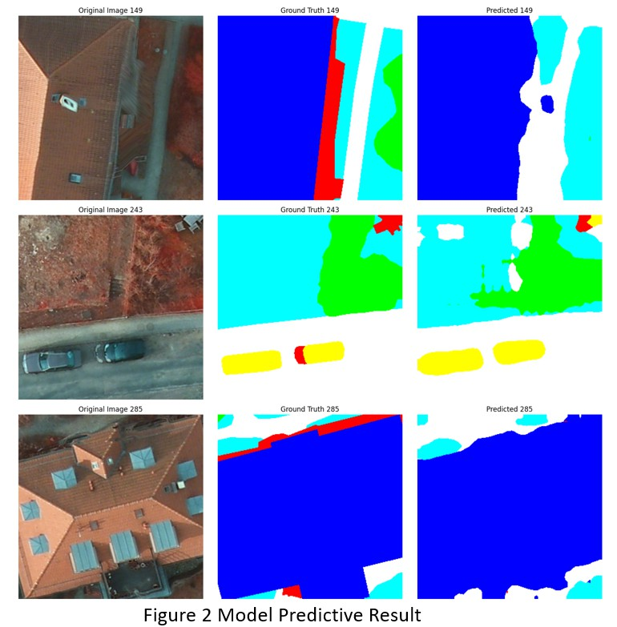
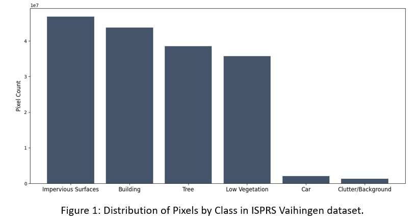

# Fine Tuning Segmentation Framework

**Background**
This notebook presents a comprehensive framework for semantic segmentation tasks, with a focus on fine-tuning models on the ISPRS dataset. The core structure is organized into functional and class-based modules for data management and model training, followed by the main training script in the final section. You may skip the first two sections and go directly to the main training script to understand the overall training process. If you need further details, feel free to refer back to the corresponding functions or classes as needed.

**Overview of Code Structure**
1. Data Management: Reads image files and their corresponding labels using `read_isprs_images`. Converts RGB labels to class IDs and performs resizing/normalization using the `ISPRSDataset` class.

2. Model Training Workflow: Supports both DeepLabv3-ResNet and FCN-ResNet architectures for fine-tuning. All pretrained layers are frozen, while the classifier and auxiliary classifier layers are unfrozen (`initialize_fcn_resnet101_model` and `initialize_deeplabv3_resnet101_model`). Training and validation per epoch are handled by `train_one_epoch` and `test_model`, respectively. The `train_val` function manages hyperparameter variations and logs results using TensorBoard. This project uses intersection over union (IoU) rather than accuracy rate to handle class imbalance in the ISPRS dataset.

4. Main Training: Integrates the data management and training modules, executing a full training pipeline with hyperparameter tuning. After training, prediction results on the test set are visualized using the best-performing model configuration.

